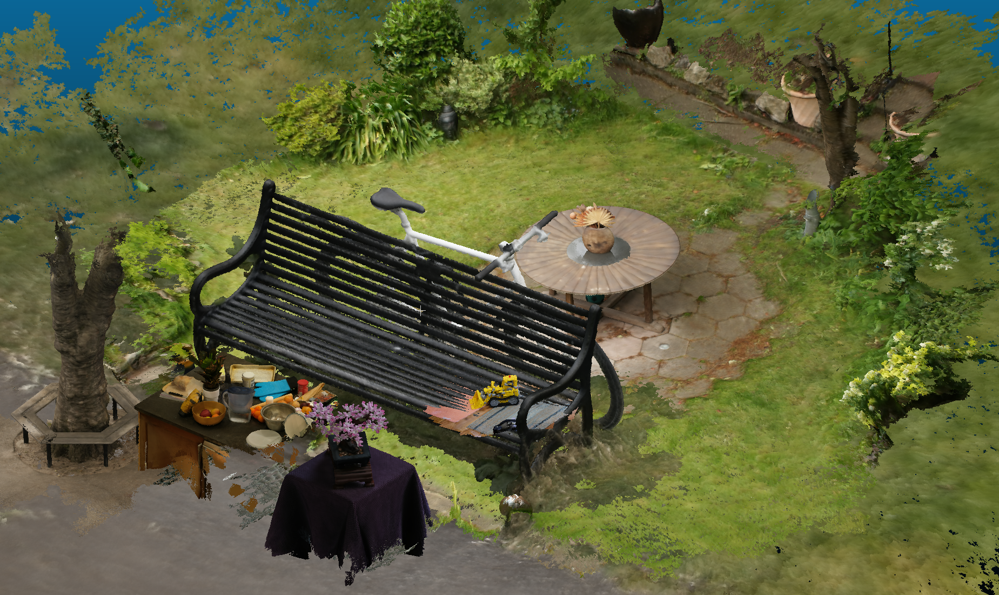

### Robustness from Extreme Viewpoints

When viewed from novel and challenging viewpoints, Geode-GS preserves scene structure and background completeness, whereas other methods exhibit severe floaters or geometric distortions.


### High-Fidelity Mesh Extraction

The high geometric accuracy of Geode-GS enables the extraction of clean, detailed surface meshes, extending 3DGS from a rendering representation to a source of fully functional geometric assets.


### Scene Composition and Editing

Assets reconstructed from entirely different capture environments, such as benches, bicycles, and tables, can be freely combined and arranged to create a new, coherent composite scene.



## 🚀 Getting Started

### 1. Environment Setup

First, clone this repository and its submodules:

```bash
git clone --recursive https://github.com/MartinWanghaha/Geode-GS.git
cd Geode-GS
```

We recommend creating a virtual environment with Conda:

```bash
conda create -n geode-gs python=3.9
conda activate geode-gs
```

Then, install the required dependencies. We depend on the `diff-gaussian-rasterization` and `simple-knn` libraries used in the original 3DGS implementation.

```bash
pip install torch torchvision torchaudio --index-url https://download.pytorch.org/whl/cu118
pip install -r requirements.txt

# Install the Gaussian rasterization submodule
cd submodules/diff-gaussian-rasterization
pip install .
cd ../..

# Install the simple-knn submodule
cd submodules/simple-knn
pip install .
cd ../..
```

### 2. Data Preparation

Our method follows the same data structure as the original 3DGS. Process your dataset with **COLMAP** to obtain camera poses. The processed dataset should have the following structure:

```text
<scene_path>
├── input/
│   ├── image1.png
│   ├── image2.png
│   └── ...
├── sparse/0/
│   ├── cameras.bin
│   ├── images.bin
│   └── points3D.bin
└── ...
```

The datasets used in our experiments can be downloaded from [Mip-NeRF 360](https://jonbarron.info/mipnerf360/), [Tanks & Temples](https://www.tanksandtemples.org/), and [Deep Blending](https://github.com/google/deep-blending).

### 3. Training

Start training with the following command. Set `-s` to the path to your scene and use `-m` to specify the model output directory.

```bash
python train.py -s /path/to/your/scene -m output/scene_name
```

For example, to train on the `garden` scene from the Mip-NeRF 360 dataset:

```bash
python train.py -s /path/to/mipnerf360/garden -m output/garden
```

### 4. Pretrained Checkpoints

Pretrained checkpoints are available for download:

- **File name:** `ckpt`
- **Download link:** [Baidu Netdisk](https://pan.baidu.com/s/1MTZHe-motYdtnR7Ky2xrEg?pwd=u5m5)
- **Access code:** `u5m5`

> **Note on evaluation metrics:** When evaluating the provided checkpoints, metrics such as PSNR, SSIM, and LPIPS may differ slightly from the values reported in the paper and the table below, but the results remain broadly consistent.

### 5. Rendering & Evaluation

After training, use `render.py` to render images from the test viewpoints and `metrics.py` to evaluate the results.

```bash
# Render
python render.py -m output/scene_name

# Evaluate
python metrics.py -m output/scene_name
```

## 📈 Quantitative Results

Our quantitative evaluation results on the Mip-NeRF 360 dataset are shown below. Geode-GS achieves substantial improvements in SSIM and LPIPS.

| **Method** | **PSNR ↑** | **SSIM ↑** | **LPIPS ↓** |
| :--- | :---: | :---: | :---: |
| 3DGS | 27.24 | 0.803 | 0.246 |
| Mip-Splatting | 27.97 | 0.838 | 0.179 |
| EDGS | 28.06 | 0.840 | 0.174 |
| 3DGS-MCMC | **28.15** | 0.842 | 0.176 |
| **Geode-GS (Ours)** | 28.03 | **0.844** | **0.162** |

Please refer to our paper for more detailed results.
