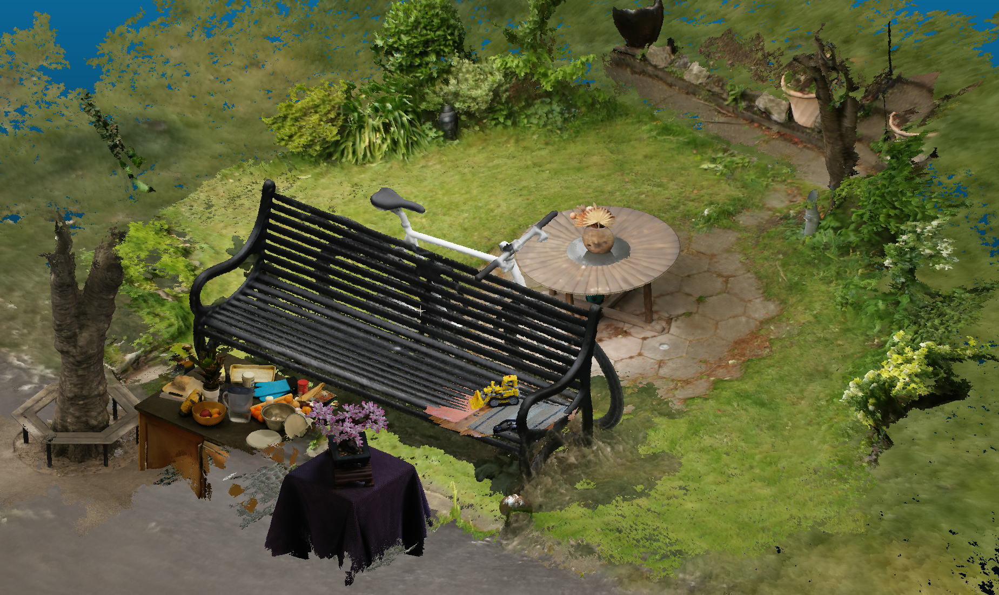

---

# Geode-GS: 几何引导的密集三维高斯溅射 (Geometrically-Guided Dense 3D Gaussian Splatting)

<p align="center">
    
</p>
<p align="center">
    <em>Geode-GS 框架概览。我们的方法集成了密集的几何初始化、几何感知的渲染管线和融合法线监督，以实现高保真的新视角合成和精确的表面重建。</em>
</p>

<p align="center">
  <a href="https://arxiv.org/abs/YOUR_ARXIV_ID_HERE">[📄 论文]</a> •
  <a href="https://github.com/MartinWanghaha/Geode-GS">[💻 项目主页]</a> •
  <a href="https://www.youtube.com/watch?v=YOUR_VIDEO_ID_HERE">[📹 视频 (即将推出)]</a>
</p>

## 📜 简介 (Introduction)

3D高斯溅射 (3DGS) 通过可微分光栅化技术实现了实时、高质量的新视角合成。然而，它的优化过程完全由2D图像的光度损失驱动，这导致模型倾向于寻找拟合训练视图的“捷径”解，而非物理上正确的几何结构。这种固有的局限性常常导致重建场景中出现**表面结构伪影**、**浮空伪影 (floaters)** 和**几何空洞**等问题。

为了解决这些问题，我们提出了 **Geode-GS**，一个用于**几何引导的密集3D高斯溅射**的框架。该方法在一个统一的优化目标中整合了**几何保真度**和**光度真实感**。我们的贡献包括：

- **📍 密集的几何初始化:** 我们采用密集特征匹配和三角化技术，一次性生成一个全局覆盖且几何精确的超完备高斯基元集合，从根本上解决了初始点云稀疏的问题。
- **📐 几何感知的渲染:** 我们设计了一个能够渲染每个像素深度和表面法线值的渲染管线，为施加几何监督提供了明确的空间信息。
- **💡 融合法线监督:** 我们引入了一种创新的融合法线监督策略。通过利用先验法线引导的滤波，我们生成高质量且鲁棒的融合法线图作为额外的几何损失，有效克服了单一光度损失的局限性。

实验结果表明，Geode-GS 在多个具有挑战性的基准数据集（如 Mip-NeRF360、Deep Blending 和 Tanks & Temples）上实现了SOTA的渲染质量。更重要的是，我们的方法显著提升了**几何精度**，能够提取出**高保真、干净的表面网格**，使重建对象可以作为功能齐全的几何资产用于下游应用（如场景组合和编辑）。

## ✨ 效果展示 (Results)

### 渲染质量对比 (Qualitative Rendering Comparison)

与当前SOTA方法（如 EDGS 和 PGSR）相比，Geode-GS 生成的渲染结果具有明显更少的伪影和更高的细节保真度。


### 极限视角下的鲁棒性 (Robustness from Extreme Viewpoints)

从新颖且具挑战性的视角观察时，Geode-GS 仍能保持场景结构和背景的完整性，而其他方法则出现严重的浮空伪影或几何扭曲。


### 高保真网格提取 (High-Fidelity Mesh Extraction)

Geode-GS 的高几何精度使得提取干净、细节丰富的表面网格成为可能，将3DGS从纯粹的渲染表示提升为功能齐全的几何资产。


### 场景组合与编辑 (Scene Composition and Editing)

我们可以自由地组合和排列从完全不同的捕获环境中重建的资产（例如长凳、自行车和桌子），构建一个全新的、逻辑上连贯的聚合场景。




## 🚀 快速开始 (Getting Started)

### 1. 环境设置 (Environment Setup)

首先，克隆本仓库及其子模块：
```bash
git clone --recursive https://github.com/MartinWanghaha/Geode-GS.git
cd Geode-GS
```

我们建议使用 Conda 创建虚拟环境：
```bash
conda create -n geode-gs python=3.9
conda activate geode-gs
```

然后，安装所需的依赖包。我们依赖于原始 3DGS 中的 `diff-gaussian-rasterization` 和 `simple-knn` 库。
```bash
pip install torch torchvision torchaudio --index-url https://download.pytorch.org/whl/cu118
pip install -r requirements.txt

# 安装高斯光栅化子模块
cd submodules/diff-gaussian-rasterization
pip install .
cd ../..

# 安装 simple-knn 子模块
cd submodules/simple-knn
pip install .
cd ../..
```

### 2. 数据准备 (Data Preparation)

我们的方法遵循与原始 3DGS 相同的数据结构。请使用 **COLMAP** 处理您的数据集以获取相机位姿。处理后的数据集应具有以下结构：
```
<scene_path>
├── input/
│   ├── image1.png
│   ├── image2.png
│   └── ...
├── sparse/0/
│   ├── cameras.bin
│   ├── images.bin
│   └── points3D.bin
└── ...
```
您可以从 [Mip-NeRF 360](https://jonbarron.info/mipnerf360/)、[Tanks & Temples](https://www.tanksandtemples.org/) 和 [Deep Blending](https://github.com/google/deep-blending) 下载实验所用的数据集。

### 3. 训练 (Training)

使用以下命令开始训练。请将 `-s` 参数替换为您的场景路径，并使用 `-m` 指定模型输出目录。
```bash
python train.py -s /path/to/your/scene -m output/scene_name```
例如，训练 Mip-NeRF 360 数据集中的 `garden` 场景：
```bash
python train.py -s /path/to/mipnerf360/garden -m output/garden
```

### 4. 渲染与评估 (Rendering & Evaluation)

训练完成后，您可以使用 `render.py` 脚本来渲染测试集视角的图像，并使用 `metrics.py` 进行评估。
```bash
# 渲染
python render.py -m output/scene_name

# 评估
python metrics.py -m output/scene_name
```

## 📈 定量结果 (Quantitative Results)

我们在 Mip-NeRF 360 数据集上的定量评估结果如下，Geode-GS 在 SSIM 和 LPIPS 指标上取得了显著优势。

| **Method** | **PSNR ↑** | **SSIM ↑** | **LPIPS ↓** |
| :--- | :---: | :---: | :---: |
| 3DGS | 27.24 | 0.803 | 0.246 |
| Mip-Splatting | 27.97 | 0.838 | 0.179 |
| EDGS | 28.06 | 0.840 | 0.174 |
| 3DGS-MCMC | **28.15** | 0.842 | 0.176 |
| **Geode-GS (Ours)** | 28.03 | **0.844** | **0.162** |

更多详细结果请参阅我们的论文。

## 引用 (Citation)

如果您在您的研究中使用了我们的工作，请引用：```bibtex
@article{wang2025geodegs,
    title={Geode-GS: Geometrically-Guided Dense 3D Gaussian Splatting},
    author={Wang, Yinchu and Du, Songlin and Cheng, Ximeng and Lu, Xiaobo},
    journal={arXiv preprint arXiv:XXXX.XXXXX},
    year={2025}
}
```

## 致谢 (Acknowledgements)

这项工作建立在 [3D Gaussian Splatting](https://github.com/graphdeco-inria/gaussian-splatting) 的杰出研究之上。我们感谢原作者的巨大贡献。我们的代码也部分参考了其他优秀的开源项目，PGSRD(https://github.com/zju3dv/PGSR/tree/main)和EDGS(https://github.com/CompVis/EDGS)，在此一并表示感谢。
